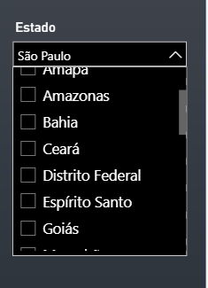

# BI – Cobertura de Telefonia Móvel no Brasil (Nacional)

Painel Power BI para analisar a distribuição de 2G, 3G, 4G e 5G por **Região**, **UF** e **Município**, com comparação por **ano** e **operadora**.

---

## 🎯 Objetivo
Mensurar o nível de cobertura da **Telefonia Móvel** no Brasil, calculando a **porcentagem de abrangência** de cada tecnologia (2G/3G/4G/5G) por **região**, **estado** e **município**.
O painel permite filtros por **Tecnologia**, **Operadora**, **Ano** e recorte geográfico.

**Cálculos-base (exemplos):**
- `% Moradores Cobertos = Moradores Cobertos / Moradores do Município × 100`
- `% Domicílios Cobertos = Domicílios Cobertos / Domicílios do Município × 100`
- `% Área Coberta = Área Coberta (km²) / Área do Município (km²) × 100`

---

## 🗂️ Estrutura
```
bi-telecom-brasil/
├─ dados/                      # CSVs originais e tratados
├─ painel/                     # Power BI (.pbix) ou template (.pbit)
├─ imagens/                    # prints dos painéis
├─ documentacao/               # relatórios e notas técnicas
├─ .gitignore
├─ LICENSE
└─ README.md
```

---

## 🔗 Fonte dos dados
- **Órgão**: ANATEL – Governo Federal
- **Conjunto**: *Meu Município — Acessos e Cobertura de Telecomunicações*
- **Link oficial**: https://dados.gov.br/dados/conjuntos-dados/meu-municipio---acessos-e-cobertura-de-telecomunicacoes
- **Arquivo**: `dados/Meu_Municipio_Cobertura.csv`
- **Observação**: Cobertura estimada a partir de estações licenciadas e modelo de propagação (ver metadados ANATEL).

---

## 🧱 Modelo de Dados (Power BI)


**Esquema estrela**: tabela **Fato** (métricas de cobertura e chaves) ligada às dimensões **Calendário**, **Região**, **Estado**, **Município**, **Tecnologia**, **Operadora**.

---

## 📊 Visuais do painel
### Painel 1 – Capa


### Painel 2 – Estado


### Painel 3 – Região


**Exemplos de comparação**
- 5G/CLARO:  
    
  
- 4G/VIVO:  
    
  

**Filtros (prints)**
- UF: `imagens/filtro_uf_dropdown.png`
- Operadora: `imagens/filtro_operadora_dropdown.png`
- Ano: `imagens/filtro_ano_dropdown.png`

---

## ▶️ Como reproduzir
1. Coloque o CSV em `dados/Meu_Municipio_Cobertura.csv`.
2. Abra `painel/BI_Telecom_Brasil.pbix` (ou `.pbit`), atualize as conexões para a pasta `dados/`.
3. Atualize o relatório e navegue pelos slicers (Região/UF/Município, Tecnologia, Operadora, Ano).

---

## 📄 Licença
Código e documentação sob **MIT**. Dados: **ANATEL** (ver termos no link da fonte).
