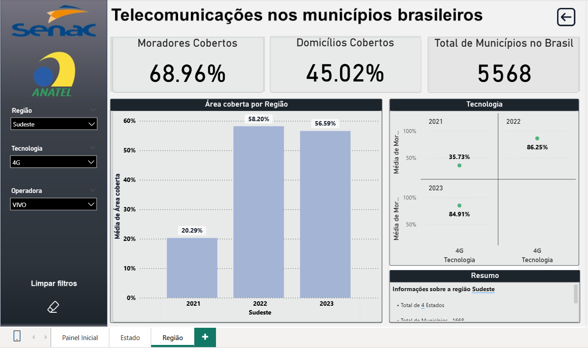
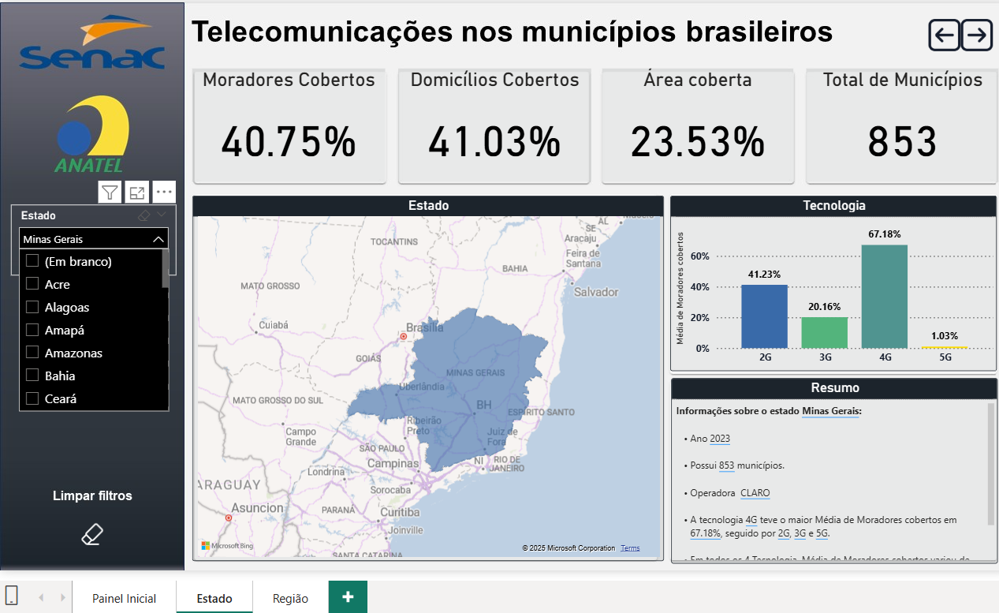
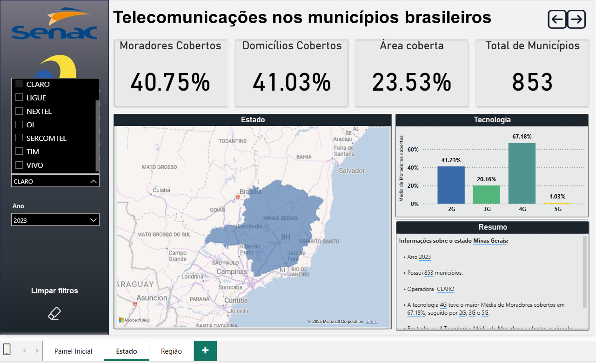
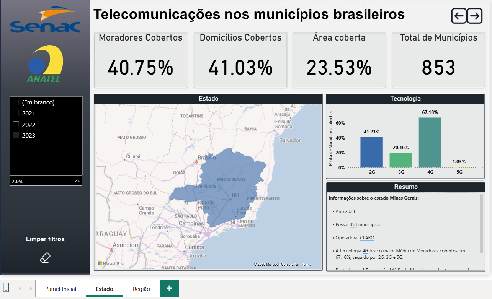
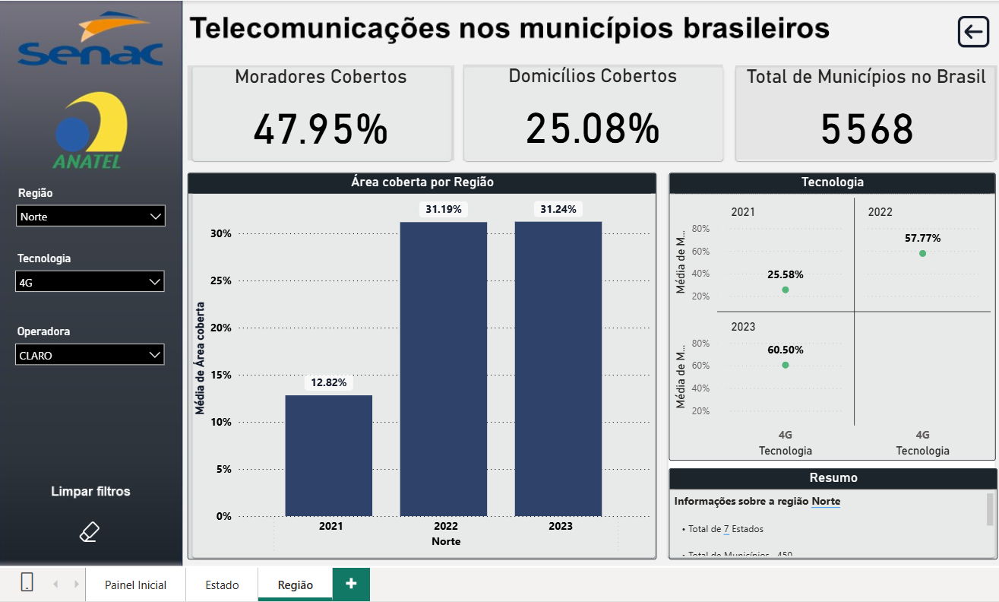
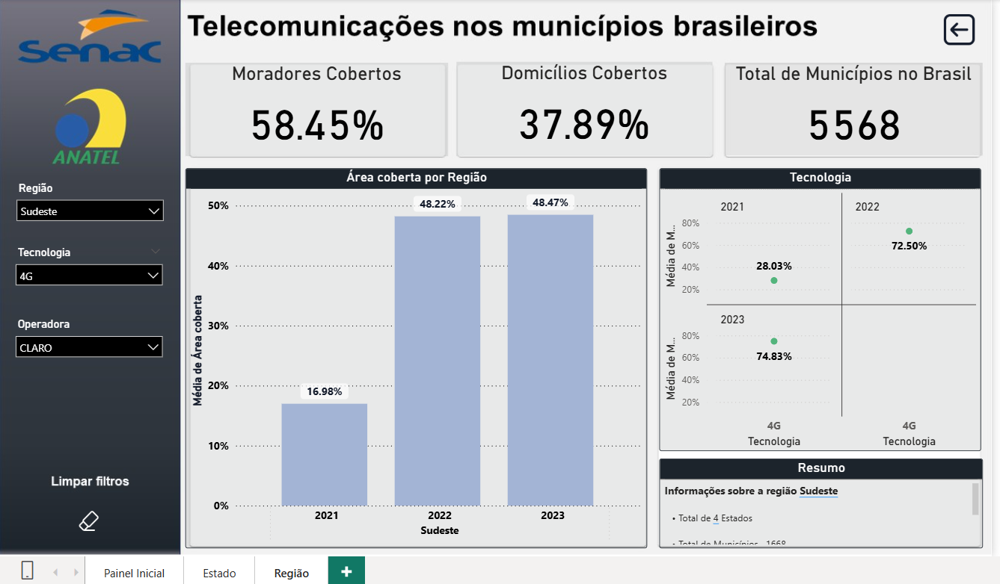

# BI – Cobertura de Telefonia Móvel no Brasil

Dashboard em **Power BI** para visualizar a cobertura **2G/3G/4G/5G** no Brasil por **Região**, **UF** e **Município**, com recortes por **Operadora** e **Ano**.

---

## 🔎 Visão geral 

- **Objetivo:** mostrar **quanto** cada tecnologia móvel cobre, onde cobre e **como evoluiu ao longo dos anos**.
- **Público-alvo:** gestores e analistas que precisam de **leituras rápidas** e comparações.
- **Navegação:** 3 painéis curtos → **Capa** → **Estado** → **Região**.

---

## 📊 Painéis

**1) Capa**\
Identificação do trabalho (Senac, curso/disciplina, autor e orientador) e acesso aos demais painéis.\


**2) Estado (UF)**\
Filtros: **UF**, **Operadora**, **Ano**.\
Mostra **Moradores Cobertos (%)**, **Domicílios Cobertos (%)**, **Área Coberta (%)**, **Total de Municípios**, **mapa** da UF e **barras 2G–5G**.\


**3) Região**\
Filtros: **Região**, **Tecnologia**, **Operadora**, **Ano**.\
Compara regiões (N, NE, CO, SE, S) e traz evolução **anual** com foco em ritmo de implantação.\


> **Exemplo:** 5G/Claro acelerou de 2022→2023 no **Centro‑Oeste** (0 → 0,52% → 3,46%) vs **Nordeste** (0 → 0,46% → 1,67%).

---

**Comparação 4G – Claro (Norte × Sudeste)**

- **Norte**: 2021 → **12,82%**, 2022 → **31,19%**, 2023 → **31,24%** (média de área coberta).\


- **Sudeste**: 2021 → **16,98%**, 2022 → **48,22%**, 2023 → **48,47%** (média de área coberta).\

## 📸 Dashboard - Imagens

### 💻 Painel Inicial  


### 💻 Painel Estado


### 💻 Painel Região




##  Dashboard - Filtros

### Filtros no painel Estado

| Estado | Operadora | Ano |
|---|---|---|
|  |  | 

### ⚖️ Exemplo de filtro Comparação 4G — Claro (Norte × Sudeste)

| Norte | Sudeste |
|---|---|
|  |  |


## 🧮 KPIs (como calculei)

- **Moradores Cobertos (%)** = `Moradores_Cobertos / Moradores_Município × 100`
- **Domicílios Cobertos (%)** = `Domicílios_Cobertos / Domicílios_Município × 100`
- **Área Coberta (%)** = `Área_km²_Coberta / Área_km²_Município × 100`
- **Total de Municípios** = `DISTINCTCOUNT(Município)`

> Se a base já trouxer percentuais municipais, uso **médias adequadas** para evitar **dupla normalização**.

---

## 🧱 Modelo (resumo)

Modelo **estrela**: uma **Fato** (métricas de cobertura + chaves) e dimensões de **Calendário**, **Região**, **UF**, **Município**, **Tecnologia**, **Operadora**.\
Relacionamentos 1:\* da dimensão para a fato; os filtros fluem da dimensão para a fato.

---

## ▶️ Como usar

1. Coloque `dados/Meu_Municipio_Cobertura.csv`.
2. Abra `painel/BI_Telecom_Brasil.pbix` (ou `.pbit`) e aponte a origem para `dados/`.
3. Use os **slicers** (Região/UF/Município, Tecnologia, Operadora, Ano) e leia os **KPIs**.

---

## 🗂️ Estrutura do repositório

```
BI_Telecom_Brasil/
├─ dados/ Meu_Municipio_Cobertura.csv
├─ painel/ BI_Telecom_Brasil.pbix
├─ imagens/ (prints dos painéis e filtros)
├─ documentacao/ (opcional)
├─ .gitignore • LICENSE • README.md
```

Imagens utilizadas ficam na pasta `imagens/` do repositório.

---

## 🔗 Dados & Licenças

- **Fonte:** ANATEL – *Meu Município: Acessos e Cobertura de Telecomunicações*.\
  Link: [https://dados.gov.br/dados/conjuntos-dados/meu-municipio---acessos-e-cobertura-de-telecomunicacoes](https://dados.gov.br/dados/conjuntos-dados/meu-municipio---acessos-e-cobertura-de-telecomunicacoes)
- **Observação de método:** cobertura é **estimada** (predição com base em ERBs e modelo de propagação).
- **Código/Docs deste repo:** **MIT**.
- **Dados (CSV):** seguem os **termos/licença da ANATEL** (consulte a página oficial).

---

## 🙋🏻‍♂️ Sobre o trabalho

Construí este dashboard como meu **TCC** na pós em Banco de Dados & BI (Senac). Minha meta foi transformar a base da ANATEL em respostas objetivas: **onde** cada tecnologia (2G–5G) chega, **quanto** cobre e **como** evolui no tempo. Estruturei tudo para **leitura rápida**: KPIs claros, filtros que seguem o fluxo de análise e comparações entre **regiões, UFs e operadoras**.


*Marcio Xavier. (2023–2025). BI – Cobertura de Telefonia Móvel no Brasil. GitHub. Dados: ANATEL.*


